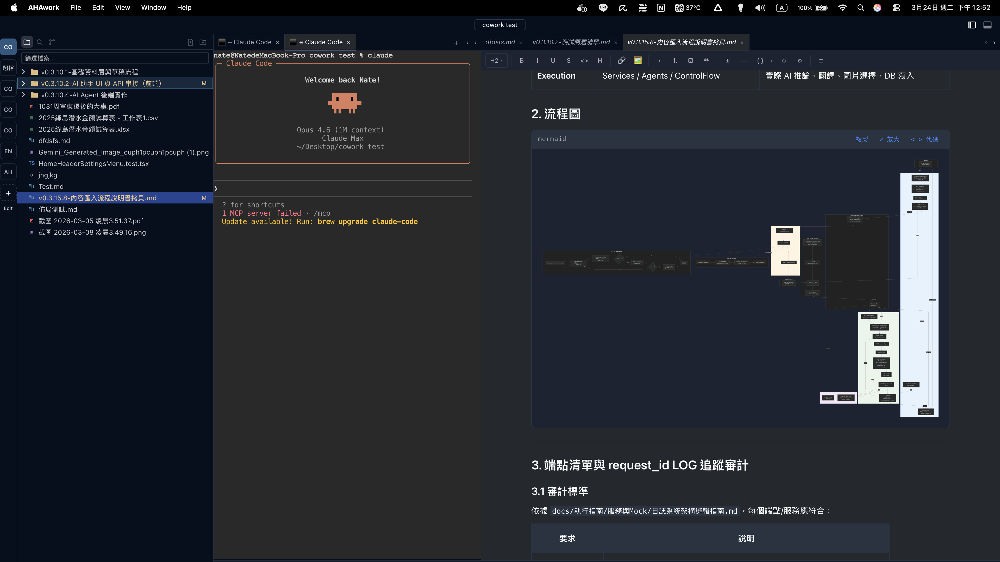
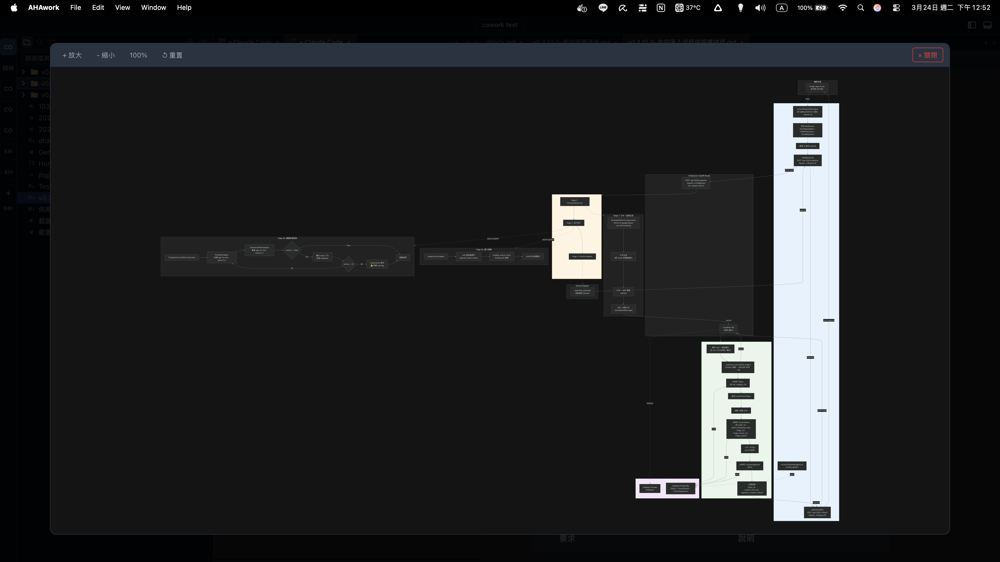
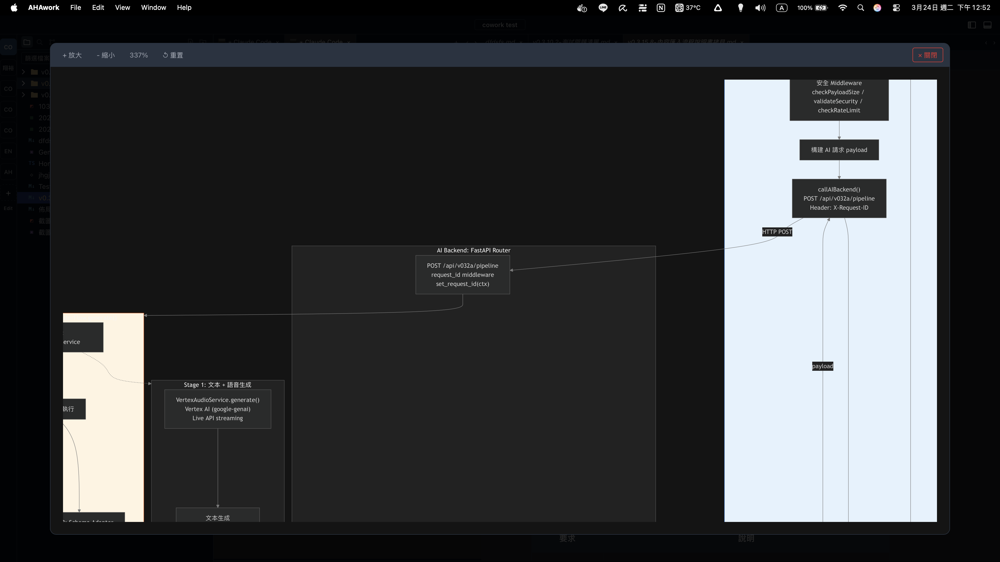

# AHAwork `Preview` — Feature Overview / 功能總覽

---

## Multi-Project Workspace / 多專案工作空間

Work on multiple projects in a single window. No need to open separate editor instances or juggle between windows.

在同一個視窗中處理多個專案。不需要開啟多個編輯器視窗或在視窗之間切換。

- Open multiple project folders simultaneously / 同時開啟多個專案資料夾
- Switch with one click or `⌥⌘↑` / `⌥⌘↓` / 一鍵切換或用快捷鍵
- Each project maintains independent state (file tree, open tabs, terminal sessions) / 每個專案維護獨立狀態
- Drag to reorder projects / 拖曳排序專案
- Session persistence — restored on restart / 工作階段持久化，重啟後自動恢復

**Why this matters:** Traditional editors like VSCode require a separate window per project. AHAwork keeps everything in one place.

**為什麼重要：** 傳統編輯器如 VSCode 每個專案需要獨立視窗。AHAwork 將一切集中在同一處。

---

## Smart Tab System: Preview & Pin / 智慧分頁系統：預覽與釘選

AHAwork uses a preview/pin model that prevents tab clutter. You won't end up with 30 open tabs from casually browsing files.

AHAwork 使用預覽/釘選模式防止分頁氾濫。瀏覽檔案時不會無腦開出一堆分頁。

### How it works / 運作方式

| Action / 操作 | Result / 結果 |
| --- | --- |
| **Single-click** a file / **單擊**檔案 | **Preview mode / 預覽模式** — temporary tab with italic title. Clicking another file replaces it / 暫時分頁，斜體標題。點擊其他檔案會取代它 |
| **Double-click** a file / **雙擊**檔案 | **Pinned tab / 釘選分頁** — stays open permanently / 永久保持開啟 |
| Start editing a preview tab / 開始編輯預覽分頁 | Auto-upgrades to pinned / 自動升級為釘選 |

This means single-clicking through 10 files in the explorer only ever uses one tab slot. Only the files you deliberately open (double-click) or edit stay as permanent tabs.

這代表在檔案總管中單擊瀏覽 10 個檔案只會佔用一個分頁位置。只有你刻意開啟（雙擊）或編輯的檔案才會成為永久分頁。

### Right-click context menu / 右鍵選單

- **Pin/Unpin / 釘選/取消釘選** — Toggle between preview and pinned / 切換預覽與釘選狀態
- **Close / 關閉** (`⌘W`) — Close the tab / 關閉分頁
- **Close others / 關閉其他** — Close all other closable tabs / 關閉其他所有可關閉的分頁

### Unsaved changes protection / 未儲存變更保護

Tabs with unsaved changes show a dot indicator (●). When closing such a tab, a dialog appears:

有未儲存變更的分頁會顯示圓點指示器（●）。關閉時會出現對話框：

- **Save / 先儲存** — Save then close / 儲存後關閉
- **Discard / 不儲存** — Discard changes and close / 捨棄變更並關閉
- **Cancel / 取消** — Go back to editing / 返回繼續編輯

---

## Integrated Terminal / 整合式終端機

A full terminal emulator lives inside AHAwork. Run your shell, AI CLIs, build tools — without leaving the workspace.

完整的終端機模擬器內建於 AHAwork。執行 shell、AI CLI、建置工具，無需離開工作空間。

**Performance / 效能：**

- WebGL GPU-accelerated rendering via xterm.js / 透過 xterm.js 實現 WebGL GPU 加速渲染
- Base64 IPC transport for efficient Rust ↔ WebView communication / Base64 IPC 高效 Rust ↔ WebView 通訊
- Flow control to handle fast-scrolling output / 流量控制處理快速捲動的輸出
- Multiple sessions per project / 每個專案可開啟多個工作階段

### Terminal drag to editor / 終端機拖曳到編輯區

You can drag a terminal session from the bottom panel into the editor area, where it becomes a regular tab alongside your files. The terminal keeps running and maintains its full state (scroll history, running processes, etc.).

你可以將終端機工作階段從底部面板拖曳到編輯區，成為與檔案並列的一般分頁。終端機持續運行並保持完整狀態（捲動歷史、執行中的程序等）。

This is especially useful for monitoring a long-running process (like `claude` or a dev server) while editing files side by side.

這在監控長時間運行的程序（如 `claude` 或開發伺服器）的同時編輯檔案時特別實用。

### Terminal-aware layout protection / 終端機感知的佈局保護

Editor groups that contain a running terminal are **protected**:

包含執行中終端機的編輯器群組會受到**保護**：

- Opening a new file will **not** replace or overwrite a terminal tab / 開啟新檔案**不會**取代或覆蓋終端機分頁
- If all editor groups have terminals, AHAwork automatically creates a **new split group** for the file / 如果所有編輯器群組都有終端機，AHAwork 會自動為檔案建立**新的分割群組**
- This prevents you from accidentally losing a terminal session with a running process / 防止你意外失去有程序在運行的終端機工作階段

**AI CLI tools that work inside AHAwork / 可在 AHAwork 內使用的 AI CLI 工具：**

- `claude` — Anthropic's Claude Code CLI
- `gh copilot` — GitHub Copilot in the terminal / 終端機版 GitHub Copilot
- `aider` — AI pair programming / AI 配對程式設計
- Any tool that runs in a standard terminal / 任何在標準終端機中運行的工具

---

## Layout Management / 佈局管理

Every panel is resizable and toggleable.

每個面板都可調整大小與切換顯示。

| Panel / 面板 | Description / 說明 | Toggle / 切換 |
| --- | --- | --- |
| **Sidebar / 側邊欄** | Explorer, Search, Git — three switchable views / 檔案總管、搜尋、Git — 三種可切換視圖 | `⌘⇧←` |
| **Editor area / 編輯區** | Horizontal and vertical splits / 水平與垂直分割 | — |
| **Bottom panel / 底部面板** | Terminal sessions / 終端機工作階段 | `⌘⇧↓` |
| **Outline / 大綱** | Document structure / 文件結構 | `⌘⇧O` |

**Interactions / 互動：**

- Drag dividers to resize / 拖曳分隔線調整大小
- Tab drag-and-drop between split groups / 分頁可在分割群組間拖放
- Full layout persistence on restart / 重啟時完整恢復佈局
- Zoom: `⌘⇧+` / `⌘⇧-` / `⌘0`

---

## Document Editing / 文件編輯

A Markdown editor built on [Tiptap](https://tiptap.dev/) (ProseMirror-based).

基於 [Tiptap](https://tiptap.dev/)（ProseMirror）的 Markdown 編輯器。

- Real-time Markdown rendering / 即時 Markdown 渲染
- Syntax-highlighted code blocks for 100+ languages / 支援 100+ 語言的語法高亮
- File explorer with tree navigation / 檔案總管樹狀導覽
- Split editors (horizontal / vertical) / 分割編輯器（水平 / 垂直）

---

## Mermaid Diagrams / 支援 Mermaid 流程圖

Render [Mermaid](https://mermaid.js.org/) diagrams directly inside your Markdown documents. Write flowcharts, sequence diagrams, and more — they render in real time as you type.

在 Markdown 文件中直接渲染 [Mermaid](https://mermaid.js.org/) 圖表。撰寫流程圖、序列圖等，輸入時即時渲染。

### Example / 範例

- Supports flowcharts, sequence diagrams, class diagrams, state diagrams, and more / 支援流程圖、序列圖、類別圖、狀態圖等

- Live preview while editing / 編輯時即時預覽

- Export as image / 可匯出為圖片

---

\## Global Search / 全域搜尋

Search across all files in your workspace. Results are grouped by file with line-level navigation — click a result to jump directly to that line.

在工作空間的所有檔案中搜尋。結果依檔案分組並支援行級導覽 — 點擊結果直接跳轉至該行。

---

## File Watcher & Conflict Handling / 檔案監控與衝突處理

- External file changes sync to open editors automatically / 外部檔案變更自動同步至開啟的編輯器
- **Conflict banner / 衝突橫幅** — When external changes collide with your unsaved edits / 當外部變更與你的未儲存編輯衝突時
- **Deleted file banner / 已刪除檔案橫幅** — When an open file is deleted externally / 當開啟的檔案被外部刪除時

---

## Git Integration / Git 整合

Built-in Git support powered by Rust's `git2-rs`, accessible from the sidebar.

內建 Git 支援，基於 Rust 的 `git2-rs`，可從側邊欄存取。

- File status tracking and staging / 檔案狀態追蹤與暫存
- Commit, push, pull operations / 提交、推送、拉取操作
- Branch switching and management / 分支切換與管理
- Commit history and diff viewer / 提交歷史與差異檢視器
- Git graph visualization / Git 圖形化視覺呈現
- Worktree support / Worktree 支援

---

## Why Rust? / 為什麼用 Rust？

AHAwork uses [Tauri v2](https://v2.tauri.app/) with a Rust backend instead of Electron:

AHAwork 使用 [Tauri v2](https://v2.tauri.app/) 搭配 Rust 後端，取代 Electron：

| Metric / 指標 | Electron | Tauri (Rust) |
| --- | --- | --- |
| App size / 應用程式大小 | \~150-300 MB | \~10-30 MB |
| Memory usage / 記憶體使用 | High (Chromium) / 高 | Low (native WebView) / 低 |
| Startup time / 啟動速度 | Slower / 較慢 | Faster / 較快 |
| Security / 安全性 | Node.js attack surface / Node.js 攻擊面 | Rust memory safety / Rust 記憶體安全 |
| Backend / 後端 | JavaScript/Node.js | Rust (compiled, type-safe) / Rust（編譯、型別安全） |

All heavy operations — filesystem access, Git operations, terminal process management — run in compiled Rust code. The frontend is a lightweight React app rendered in the system's native WebView.

所有繁重操作 — 檔案系統存取、Git 操作、終端機程序管理 — 都在編譯後的 Rust 程式碼中執行。前端是輕量的 React 應用程式，在系統原生 WebView 中渲染。