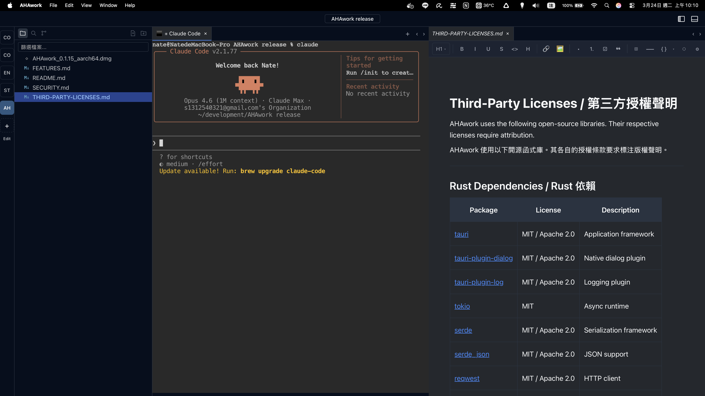

# AHAwork `Preview`

🌐 **[ahawork 官網 / Official Website](https://www.qualiaspark.cc/ahawork)**

**A Rust-powered AI workspace — where VSCode meets Notion.**

**以 Rust 驅動的 AI 工作空間 — VSCode 與 Notion 的結合。**

> **⚠️ Preview Release / 先行預覽版**This is an early preview of AHAwork. Core features are functional, but many more are planned. Expect frequent updates and changes.
>
> 這是 AHAwork 的先行預覽版。核心功能已可使用，但仍有許多功能在規劃中。預期會有頻繁的更新與變動。

\---

AHAwork is a desktop application built with [Tauri v2](https://v2.tauri.app/) (Rust + WebView) that combines document editing, an integrated terminal, and a flexible layout system into a single workspace. It's designed as a lightweight, secure environment for knowledge workers and developers who want AI tools at their fingertips.

AHAwork 是一款基於 [Tauri v2](https://v2.tauri.app/)（Rust + WebView）的桌面應用程式，將文件編輯、整合式終端機與彈性佈局系統整合在同一個工作空間中。專為需要隨手使用 AI 工具的知識工作者與開發者打造，輕量、安全、高效。

---

## Why AHAwork? / 為什麼選擇 AHAwork？

Most AI tools today are either chat interfaces or code editors. AHAwork sits in between:

目前大多數 AI 工具不是聊天介面就是程式碼編輯器。AHAwork 介於兩者之間：

- **Document-first workspace / 文件優先的工作空間** — Write and read Markdown natively, with real-time rendering and syntax highlighting / 原生 Markdown 編輯與即時渲染、語法高亮
- **Built-in terminal / 內建終端機** — Run any CLI tool directly inside the app. Claude Code, GitHub Copilot CLI, aider — any AI assistant works out of the box / 在應用程式內直接執行任何 CLI 工具，各種 AI 助手皆可直接使用
- **Multi-project in one window / 單一視窗多專案** — Switch between multiple projects instantly without opening separate windows / 同一視窗內即時切換多個專案，無需開啟多個視窗
- **Smart tab management / 智慧分頁管理** — Preview/pin model prevents tab clutter. Terminal-aware layout protection ensures your running sessions are never accidentally overwritten / 預覽/釘選模式防止分頁氾濫。終端機感知的佈局保護確保執行中的工作階段不會被意外覆蓋
- **Rust backend / Rust 後端** — Smaller memory footprint, faster startup, and stronger security than Electron-based alternatives / 更小的記憶體佔用、更快的啟動、更強的安全性

---

## Features / 功能特色

### Multi-Project Workspace / 多專案工作空間

Switch between multiple projects in a single window — no need to manage multiple editor instances. Each project keeps its own file tree, terminal sessions, and workspace state.

在同一個視窗內切換多個專案，不需要管理多個編輯器視窗。每個專案保有獨立的檔案樹、終端機工作階段與工作空間狀態。

- Switch projects with one click or `⌥⌘↑` / `⌥⌘↓` / 一鍵切換或用快捷鍵 `⌥⌘↑` / `⌥⌘↓`
- Drag to reorder, add or remove projects on the fly / 拖曳排序，隨時新增或移除專案
- Session persistence — your layout and open projects are restored on restart / 工作階段持久化，重啟後自動恢復

### Smart Tab System: Preview & Pin / 智慧分頁系統：預覽與釘選

AHAwork uses a preview/pin model that prevents you from accidentally opening dozens of tabs:

AHAwork 使用預覽/釘選模式，防止你不小心開出一堆分頁：

| Action / 操作 | Result / 結果 |
| --- | --- |
| **Single-click** a file / **單擊**檔案 | Opens in **preview mode** — a temporary tab (italic title) that gets replaced when you click another file / 以**預覽模式**開啟 — 暫時分頁（斜體標題），點擊其他檔案會取代它 |
| **Double-click** a file / **雙擊**檔案 | Opens as a **pinned tab** — stays open permanently / 以**釘選分頁**開啟 — 永久保持開啟 |
| Start editing a preview tab / 開始編輯預覽分頁 | Automatically upgrades to pinned / 自動升級為釘選分頁 |

**Right-click context menu / 右鍵選單：** Pin/unpin tab, close tab (`⌘W`), close other tabs / 釘選/取消釘選、關閉分頁、關閉其他分頁

**Unsaved changes protection / 未儲存變更保護：** When closing a tab with unsaved edits (marked with ●), a dialog asks: Save / Discard / Cancel / 關閉有未儲存編輯的分頁時（標有 ●），對話框提供：儲存 / 不儲存 / 取消

### Integrated Terminal / 整合式終端機

A full-featured terminal powered by xterm.js with WebGL GPU rendering.

基於 xterm.js 搭配 WebGL GPU 渲染的完整終端機。

- GPU-accelerated rendering / GPU 加速渲染
- Multiple terminal sessions per project / 每個專案可開啟多個終端機
- Base64 IPC for efficient data transfer / Base64 IPC 高效資料傳輸
- Flow control for handling large outputs / 流量控制處理大量輸出

**Terminal layout features / 終端機佈局功能：**

- **Drag terminal to editor / 拖曳終端機到編輯區** — Drag a terminal session from the bottom panel into the editor area as a tab. The terminal keeps running and maintains its full state / 將終端機工作階段從底部面板拖曳到編輯區成為分頁。終端機持續運行並保持完整狀態
- **Terminal-aware layout protection / 終端機感知的佈局保護** — Editor groups containing a running terminal are "protected" — opening a new file won't overwrite them. If all groups have terminals, a new split group is automatically created for the file / 包含執行中終端機的編輯器群組受到「保護」— 開啟新檔案不會覆蓋它們。如果所有群組都有終端機，會自動建立新的分割群組來放置檔案

### Layout Management / 佈局管理

| Panel / 面板 | Description / 說明 | Toggle / 切換 |
| --- | --- | --- |
| **Sidebar / 側邊欄** | File explorer, global search, Git panel / 檔案總管、全域搜尋、Git 面板 | `⌘⇧←` |
| **Editor area / 編輯區** | Split horizontally or vertically / 水平或垂直分割 | — |
| **Bottom panel / 底部面板** | Terminal sessions / 終端機工作階段 | `⌘⇧↓` |
| **Outline / 大綱** | Document structure / 文件結構 | `⌘⇧O` |

- Drag dividers to resize any panel / 拖曳分隔線調整任何面板大小
- Tab drag-and-drop between split groups / 分頁可在分割群組間拖放
- Sidebar switches between Explorer, Search, and Git views / 側邊欄切換檔案總管、搜尋與 Git 視圖
- Full layout persistence on restart / 重啟時完整恢復佈局

### Document Editor / 文件編輯器

A Markdown editor built on [Tiptap](https://tiptap.dev/).

基於 [Tiptap](https://tiptap.dev/) 的 Markdown 編輯器。

- Real-time Markdown rendering / 即時 Markdown 渲染
- Syntax-highlighted code blocks / 語法高亮程式碼區塊
- Split editors (horizontal / vertical) / 分割編輯器（水平 / 垂直）

### Global Search / 全域搜尋

Search across all files in your workspace with real-time results, grouped by file with line-level navigation.

在工作空間的所有檔案中搜尋，即時顯示結果，依檔案分組並可跳轉至指定行。

### File Watcher / 檔案監控

Automatic file change detection with conflict handling:

自動偵測檔案變更並處理衝突：

- External modifications sync to open editors / 外部修改同步至開啟的編輯器
- Conflict banner when external changes collide with unsaved edits / 外部變更與未儲存編輯衝突時顯示衝突橫幅
- Deleted file notification banner / 已刪除檔案通知橫幅

### Git Integration / Git 整合

Built-in Git support powered by `git2-rs`, accessible from the sidebar:

內建 Git 支援，基於 `git2-rs`，可從側邊欄存取：

- File status tracking and staging / 檔案狀態追蹤與暫存
- Commit, push, pull operations / 提交、推送、拉取操作
- Branch switching and management / 分支切換與管理
- Commit history and diff viewer / 提交歷史與差異檢視器
- Git graph visualization / Git 圖形化視覺呈現

---

### Notifications & AI Hook Integration / 通知系統與 AI Hook 整合

Get notified when long-running tasks finish — no more staring at your terminal. AHAwork registers a `cowork://` Deep Link that any CLI tool or AI assistant can trigger.

執行長時任務時自動收到通知 — 不用再盯著終端機。AHAwork 註冊了 `cowork://` Deep Link，任何 CLI 工具或 AI 助手都能觸發通知。

- **Three delivery modes / 三種送達方式** — macOS system banner (background / different project) or in-app toast (foreground + same project); bell badge always collects the notification / macOS 系統橫幅（背景 / 不同專案）或應用內 Toast（前景 + 同專案）；鈴鐺通知中心一律收錄
- **One-click jump / 一鍵跳轉** — Click any notification to switch project and jump to the originating terminal tab / 點擊通知自動切換專案並跳到對應終端機
- **Built-in Claude Code hook / 內建 Claude Code hook** — Auto-injected `COWORK_SESSION_ID` enables precise terminal matching even after reconnect / 自動注入 `COWORK_SESSION_ID`，reconnect 後仍能精確匹配
- **Works with any tool / 相容任何工具** — Cursor, Windsurf, `cargo build`, `pnpm test` — anything that can run `open "cowork://notify?..."` / 任何能執行 `open` 指令的工具都能串接

Quick example / 快速範例：

```bash
open "cowork://notify?terminal=Claude&message=單元測試全部通過"
```

**Full integration guide / 完整串接指南**：[`docs/ai-hook-notifications.md`](docs/ai-hook-notifications.md) — Claude Code `.claude/settings.json` hook 設定、Cursor / Windsurf 接法、Shell script 包裝、疑難排查。

### Auto Update / 自動更新

AHAwork checks for updates automatically on startup. When a new version is available, a notification appears with options to update now, remind later, or skip.

AHAwork 在啟動時自動檢查更新。有新版本時會顯示通知，可選擇立即更新、稍後提醒或跳過此版本。

- **One-click update / 一鍵更新** — Download and install without leaving the app. Restart to complete / 在應用內直接下載安裝，重啟即完成更新
- **Manual check / 手動檢查** — Help → Check for Updates anytime / 隨時從 Help → 檢查更新手動觸發
- **Version history / 版本歷史** — Help → Version Info to browse all past release notes / Help → 版本資訊瀏覽所有歷史更新記錄

### Bug Report / 問題回報

Found a bug? Report it directly from the app — no need to open GitHub manually.

發現問題？直接從應用內回報，不需要手動開 GitHub Issue。

- **Help → Report a Problem / Help → 回報問題** — Fill in a simple form with title and description / 填寫簡單的標題和描述表單
- **Auto-collected diagnostics / 自動收集診斷資訊** — App version, OS, memory usage, and recent error logs are attached automatically / 自動附加版本號、作業系統、記憶體使用和近期錯誤記錄
- **Submitted as GitHub Issue / 提交為 GitHub Issue** — Your report goes directly to our issue tracker for follow-up / 回報直接進入我們的 Issue 追蹤系統

---

## Keyboard Shortcuts / 鍵盤快捷鍵

Press `⌘/` inside the app to open the keyboard shortcuts panel, which lists all available shortcuts organized by category.

在應用程式內按 `⌘/` 開啟鍵盤快捷鍵面板，列出所有可用的快捷鍵並依類別分組顯示。

Key shortcuts / 主要快捷鍵：

| Shortcut / 快捷鍵 | Action / 功能 |
| --- | --- |
| `⌘/` | **Open shortcuts panel / 開啟快捷鍵面板** |
| `⌘S` | Save / 儲存 |
| `⌘W` | Close tab / 關閉分頁 |
| `⌥⌘←` `⌥⌘→` | Switch tabs / 切換分頁 |
| `⌥⌘↑` `⌥⌘↓` | Switch projects / 切換專案 |
| `⌘⇧←` | Toggle sidebar / 切換側邊欄 |
| `⌘⇧↓` | Toggle terminal / 切換終端機 |
| `⌘⇧O` | Toggle outline / 切換大綱 |
| `⌘⇧F` | Global search / 全域搜尋 |
| `⌘⇧+` `⌘⇧-` `⌘0` | Zoom in / out / reset / 放大 / 縮小 / 重置 |

---

## Tech Stack / 技術棧

| Layer / 層級 | Technology / 技術 |
| --- | --- |
| Framework / 框架 | [Tauri v2](https://v2.tauri.app/) |
| Backend / 後端 | Rust (tokio, git2-rs, notify) |
| Frontend / 前端 | React + TypeScript |
| Editor / 編輯器 | [Tiptap](https://tiptap.dev/) (ProseMirror-based) |
| Terminal / 終端機 | xterm.js + WebGL addon |
| IPC / 跨程序通訊 | Tauri Commands (`invoke()`) |

---

## System Requirements / 系統需求

- **macOS** (Apple Silicon) — currently the only supported platform / 目前僅支援此平台
- macOS 12.0 or later recommended / 建議 macOS 12.0 以上

---

## Installation / 安裝方式

Download the latest `.dmg` from the [Releases](../../releases) page, open it, and drag AHAwork to your Applications folder.

從 [Releases](../../releases) 頁面下載最新的 `.dmg` 檔，打開後將 AHAwork 拖曳至應用程式資料夾。

---

## Use as an AI Development Environment / 作為 AI 開發環境

AHAwork works well as an environment for AI-assisted development:

AHAwork 非常適合作為 AI 輔助開發的環境：

1. Open multiple project folders in a single window / 在同一視窗開啟多個專案資料夾
2. Switch between projects instantly — no window juggling / 即時切換專案，不用在多個視窗間切換
3. Use the integrated terminal to run AI CLI tools / 使用整合式終端機執行 AI CLI 工具：
   - `claude` — Anthropic's Claude Code CLI
   - `gh copilot` — GitHub Copilot in the terminal
   - `aider` — AI pair programming / AI 配對程式設計
   - Any other terminal-based AI tool / 任何終端機 AI 工具
4. Drag terminals to the editor area for side-by-side terminal + code view / 拖曳終端機到編輯區，終端機與程式碼並排顯示
5. Terminal protection keeps your running sessions safe while you open files / 終端機保護讓你在開啟檔案時，執行中的工作階段不受影響

The Rust backend means lower resource usage compared to Electron-based editors, so your AI tools get more of your machine's resources.

Rust 後端帶來更低的資源消耗，讓你的 AI 工具能獲得更多系統資源。

---

## Architecture / 架構

```
┌─────────────────────────────────────┐
│           AHAwork Desktop           │
├──────────────┬──────────────────────┤
│  Rust        │  WebView (React)     │
│  Backend     │                      │
│              │  ┌────────────────┐  │
│  • FS ops    │  │ Project Switch │  │
│  • Git       │  ├────────────────┤  │
│  • Terminal  │  │ Document Editor│  │
│  • Watcher   │  ├────────────────┤  │
│              │  │ Terminal       │  │
│              │  ├────────────────┤  │
│              │  │ File Explorer  │  │
│              │  ├────────────────┤  │
│              │  │ Search / Git   │  │
├──────────────┴──┴────────────────┘  │
│         Tauri v2 IPC Bridge         │
└─────────────────────────────────────┘
```

All filesystem operations and process management happen in the Rust backend. The frontend communicates via Tauri's type-safe IPC commands.

所有檔案系統操作與程序管理都在 Rust 後端執行。前端透過 Tauri 的型別安全 IPC 命令進行通訊。

---

---

## Links / 相關連結

- [Tauri](https://v2.tauri.app/) — The framework powering AHAwork / AHAwork 的底層框架
- [Tiptap](https://tiptap.dev/) — The editor engine / 編輯器引擎
- [xterm.js](https://xtermjs.org/) — Terminal emulation / 終端機模擬